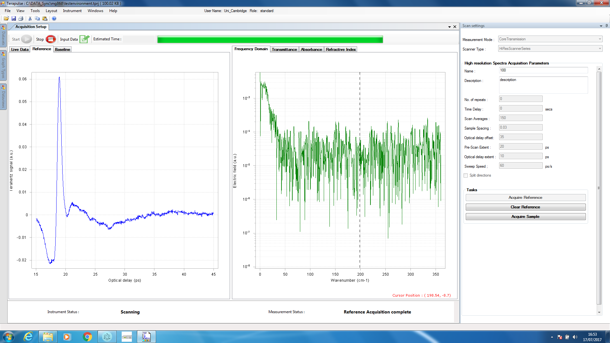

# Tera Pulse Automation (TPA)
Readme Version: 1.1 (September 2017 / uploaded and formatted March 2021)  
TPA Version:  3.3

*Thanks for reading the TPA Readme Document!*  
Its purpose is to sum up the relevant information required to
run TPA smoothly and provide some guidance for troubleshooting.  

## What is TPA?
This software originated during a [DAAD RISE internship](https://www.daad.de/rise/en/) with Prof. Dr. Axel Zeitler's [Terahertz Applications Group](https://thz.ceb.cam.ac.uk/News/summer2017), Department of Chemical Engineering and Biotechnology, University of Cambridge.  
During my terahertz spectroscopy measurements I thought about how the manual measurement process could be automated in a simple way, with the knowledge and tools available at that time. The result is my TPA software presented here. It is by no means perfect, and constitutes one of my first coding projects.  
Note that the [publication](https://doi.org/10.1016/j.ijpx.2019.100022) that was co-authored as part of the internship does not relate to the software uploaded here. 

## How does TPA work?
TPA automates all manual steps related to the measurement process, including
- moving a sample holder with two samples via a motor, manually done via the so-called IMS Terminal
- cooling the sample holder down with liquid nitrogen, manually by adjusting nitrogen flow
- heating the sample holder up to a specified temperature using a heating system
- checking and adapting the temperature using a temperature controller
- entering parameters and operating the TeraView software  


This is done by 
- controlling motor movement via a serial connection and PySerial
- operating the temperature control via a GPIB IEEE-488 connection and PyVISA
- executing mouse clicks and keyboard input via PyAutoGUI and the msvcrt package  



## Disclaimer 
This software comes without any warranty. It is not associated by any means with TeraView Ltd. or any of its products, such as TeraPulse.   
> THE SOFTWARE IS PROVIDED "AS IS", WITHOUT WARRANTY OF ANY KIND, EXPRESS OR IMPLIED, INCLUDING BUT NOT LIMITED TO THE WARRANTIES OF MERCHANTABILITY, FITNESS FOR A PARTICULAR PURPOSE, TITLE AND NON-INFRINGEMENT. IN NO EVENT SHALL THE COPYRIGHT HOLDERS OR ANYONE DISTRIBUTING THE SOFTWARE BE LIABLE FOR ANY DAMAGES OR OTHER LIABILITY, WHETHER IN CONTRACT, TORT OR OTHERWISE, ARISING FROM, OUT OF OR IN CONNECTION WITH THE SOFTWARE OR THE USE OR OTHER DEALINGS IN THE SOFTWARE.
 

## System Specifications
TPA is designed for the following hardware and software specifications:

- Operating System:	Windows 7

- TeraPulse Software:	Version 0.10.0
			bb270313abf
- TeraPulse Firmware:	Version 0.5.2

- Motor:		MDrive 23  
			Intelligent Motion Systems, Inc.

- Temperature Controller:	Model 331 Temperature Controller  
			Lake Shore Cryotronics, Inc.

- and suitable connectors for these components


  
## Installation

To be able to run TPA, make sure to...


- Connect all cables correctly:
  - GPIB IEEE-488 cable for Lake Shore 331
  - Power cable for MDrive 23
  - Serial connection for MDrive 23  
and turn both MDrive 23 and Lake Shore 331 on


- Set a screen resolution of 1920 x 1080  
	The positioning system is based on this resolution,
	and any other resolution will lead to mouse clicks
	and inputs at wrong positions.


- Install Python 2.x (for `TPA32.py`) or Python 3.x (for `TPA33.py`) and required packages
 
  - Install the PySerial (`serial`) package for handling serial controllers
  - Install the PyAutoGUI (`pyautogui`) package for automating keyboard and mouse controls  
  - Install the PyVISA (`visa`) package for measurement device control
  - Install the Colorama (`colorama`) package for making ANSI escape character sequences work under Microsoft Windows
  - Install `matplotlib` and `numpy` for data processing and visualization
  - The `msvcrt` package is required to access routines from the Microsoft VC++ runtime (there is no multiplatform solution available unfortunately)  


- Enter correct GPIB settings for the Lake Shore 331:  
  - Baud Rate:		9600  
  - IEEE Address:		12  
  - IEEE Term:		Cr Lf  
  - Emulation Mode:	331   


## Before using TPA - IMPORTANT

It is of great importance to the proper execution of the TPA
programme that the following steps are taken:


1.   Open the IMS Terminal and load the preference 
	     `SingleMotor_Mike.ltm`.  

2.  INITIALIZE the motor by typing the following
	     parameters in the console. Press Enter after
	     entering one parameter:  
```
		VA SP= 	50000
		RC= 	100
		VI= 	500
		VM= 	40000
		A= 	30000
		D= 	20000
```

3. CENTRE the reference and sample holes properly.  
	     Choose the correct centre position for both 
	     reference and sample holes and note them.  

4.  Move the platform to the REFERENCE HOLE to the
	     position you obtained in step III and set this
	     position to ZERO, by typing the command `P = 0`.

5.   Now you may close the IMS Terminal to make the
	     port accessible for TPA.  
	     You will need the centre position of the sample
	     for the initialisation process.  


**CAUTION: IT IS CRUCIAL THAT THE MOTOR HAS BEEN INITIALIZED, SET MANUALLY TO THE CENTRE OF THE REFERENCE USING THE IMS TERMINAL AND SET TO ZERO USING THE "P = 0" COMMAND.** 
**FAILING TO DO SO MIGHT END IN MOTOR FAILURE!**  
    


## How to run TPA


1. 	Open the command prompt `cmd.exe`  

	You can access the command prompt by searching "cmd" in
	the search bar, when clicking on the Windows "Start"
	button, and then press Enter
	or follow this path: `C:\Windows\System32\cmd.exe`
	or simply doubleclick on the `TPAxx.py` file.  


2.	Move to the Desktop folder  

	Type `cd Desktop` to move to change directory.  
	The TPA file should be located in the Desktop folder.  
	If the TPA file has been moved, you should check the 
	location of the TPA file and move to this directory
	using the "cd" command.  


3.	Run the TPA file with Python

	Enter `python TPAxx.py` to run the code. You should then
	see the starting screen, where you will be guided through
	the initialisation set-up.  


## Possible Issues

* TPA takes quite long to start a measurement/
  TPA does not stabilise the temperature/
  TPA does not start measuring at all:

	> If the temperature is not stable enough, TPA will not
	start a measurement.
	
	> If the tolerance is set too low (0.5K), the temperature
	controller might not reach a temperature within the
	allowed tolerance. Choose a tolerance of around 5K.

	> If the PID parameter are not correctly tuned, the
	waiting time might be too high for TPA. After the
	setpoint has changed, TPA waits  for a time which
	equals the "P" parameter in [s].
	Thus, if "P" is set too high, the waiting time increases.

	> If the flow of liquid nitrogen is not stable enough,
	frequent violations of the temperature tolerance might
	occur.
	To account for this, you could change the "D" parameter
	(press "PID/MHP" on the Lake Shore 331) and increase it.
	The controller will tackle sudden changes in temperature
	better.


* TPA makes the temperature controller beep loudly:

	> The temperature controller beeps, if the current 
	temperature is close to the set tolerance.
	Adjust your nitrogen flow in this case and try to achieve
	a stable flow.

	> If you hear a short beep followed by a long beep, this
	means that the tolerance has been exceeded and the
	measurement for the current temperature was terminated.
	Try to stabilise the temperature by adjusting the
	nitrogen flow.

	> You may open the console now and restart the measurement 
	by following the steps indicated in the console.
	

* TPA makes the motor move extremely fast/
  TPA makes the movable platform crash to its upper/lower limit:

	> If this happens, the motor has not been initialised
	properly.
	Before you start running TPA, always open the IMS
	Terminal, initialise the motor with the commands listed
	in the "Before using TPA" section and make sure the motor
	is set to the centre of the reference hole and set to
	zero using the "p=0" command.


* TPA makes my mouse move in a weird way while I use the computer/
  TPA deletes things I typed and overwrites them:

	> Using the computer while the TPA programme is running is
	not possible, as it performs mouse clicks and keyboard
	inputs.
	You may only open the console window if a measurement has
	to be terminated when the set tolerance is exceeded.

	> Make sure that the TeraPulse window is opened, a new
	TeraPulse project file has been created and do not run
	any other programme that might pop up and jump in the
	foreground.


## How to adapt TPA to your latest TeraPulse interface


With software updates for the TeraPulse software to come, the
interface might change.  

Use the software with absolute caution after a software update
has been performed!  
  
  
To keep TPA working after a software update, conduct these steps:

- Take a screenshot of the new TeraPulse interface.  

- Use an image editing software such as "paint.net" to
  obtain the new coordinates in [px] of the positions of
  all buttons that have to be clicked.  

- Open the TPA file with an editor such as "Notepad++"
  and scroll to the "INITIAL VALUES" section of the code  

- The locations of the buttons to press are stored in
  tuples, such as (354, 897).  

- Replace the positions with the ones you obtained using
  the image editing programme.  

- TPA will now move the mouse cursor to the correct
  positions of the buttons.  


## Contact


Please get in touch with me if you would like to get any
information about TPA or support with troubleshooting!  

I will be happy to help.  


Mario U. Gaimann  
DAAD RISE Worldwide Summer Research Intern  

Terahertz Applications Group  
Department of Chemical Engineering and Biotechnology  
University of Cambridge  

(C) 2017-2021 Mario Gaimann 
